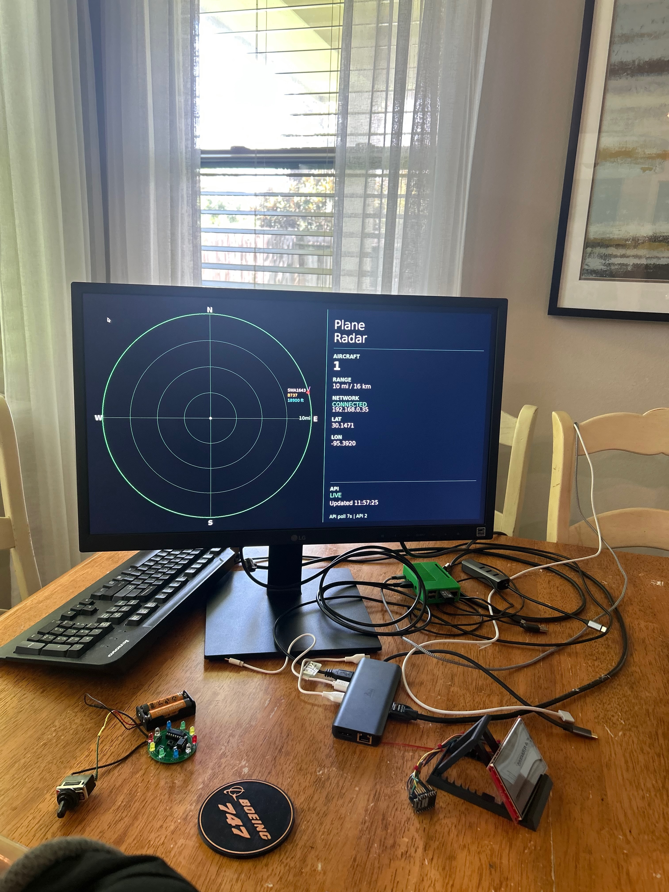

# Plane Radar Pi



A Raspberry Pi ADS-B radar display that shows nearby aircraft on an HDMI screen.

This project started as a Raspberry Pi 4B proof-of-concept port of an ESP32 live ADS-B plane radar project. The current `radar.py` has been optimized for HDMI output and is intended to run fullscreen on the Raspberry Pi desktop.

Aircraft data is fetched from the public ADS-B API at:

```text
https://opendata.adsb.fi
```

The radar display shows nearby aircraft around a configured latitude/longitude, using a circular radar-style layout with an HDMI sidebar status panel.

---

## Current HDMI Features

The current `radar.py` is optimized for HDMI and includes:

- Fullscreen HDMI output using `pygame`
- Automatic `DISPLAY=:0` handling for HDMI mode
- Crisp high-resolution radar rendering instead of scaling a 240×240 image
- Right-side status panel for aircraft count, range, network status, position, API status, and refresh timing
- Cached aircraft data so the radar does not blank out after temporary API failures
- Separate screen refresh timing and API polling timing
- Configurable minimum API poll interval
- Backoff handling for `429 Too Many Requests` API responses
- Optional systemd service support for autostart on boot

---

## Requirements

Install the required packages:

```bash
sudo apt update
sudo apt install python3-pygame python3-pil python3-requests
```

The script expects to be run on a Raspberry Pi with an HDMI display connected.

---

## Configuration

Edit `config.ini`:

```bash
nano ~/plane-radar-pi/config.ini
```

Example configuration:

```ini
[radar]
center_lat = 30.14705507846894
center_lon = -95.39204791784302
range_mi = 10

# How often the HDMI screen redraws.
# This does NOT mean an API call happens every second.
refresh_seconds = 1

# How often the script requests fresh ADS-B data.
api_poll_seconds = 10

# Safety floor for API polling.
# The effective API interval is:
# max(api_poll_seconds, minimum_api_poll_seconds)
minimum_api_poll_seconds = 10

# Maximum delay after repeated API/rate-limit failures.
# 300 seconds = 5 minutes.
max_backoff_seconds = 300

# Last successful aircraft data is saved here.
cache_file = /tmp/plane-radar-aircraft-cache.json

[display]
show_heading_lines = true
heading_line_length = 26
heading_line_gap = 7
heading_line_width = 2
```

### Recommended timing

If only the Raspberry Pi radar is running:

```ini
refresh_seconds = 1
api_poll_seconds = 10
minimum_api_poll_seconds = 10
max_backoff_seconds = 300
```

If another device on the same home network is also using the same public API, increase the API interval:

```ini
refresh_seconds = 1
api_poll_seconds = 30
minimum_api_poll_seconds = 30
max_backoff_seconds = 300
```

The public API may rate-limit by public IP address, so multiple devices in the same household can count together.

---

## Running Manually

From the project directory:

```bash
cd ~/plane-radar-pi
./radar.py --display hdmi
```

or:

```bash
cd ~/plane-radar-pi
python3 radar.py --display hdmi
```

The HDMI mode automatically sets `DISPLAY=:0` if needed, so this should work without manually typing:

```bash
DISPLAY=:0
```

To quit the HDMI display, press:

```text
Esc
```

or:

```text
q
```

---

## How Refresh and API Timing Work

These settings do different jobs:

```ini
refresh_seconds = 1
api_poll_seconds = 10
minimum_api_poll_seconds = 10
max_backoff_seconds = 300
```

Meaning:

```text
refresh_seconds
    How often the HDMI screen redraws.

api_poll_seconds
    How often the script should ask the ADS-B API for fresh aircraft data.

minimum_api_poll_seconds
    The fastest API polling allowed, even if api_poll_seconds is set lower.

max_backoff_seconds
    The longest delay the script will wait after repeated API/rate-limit failures.
```

The actual API polling interval is calculated as:

```text
effective_api_poll_seconds = max(api_poll_seconds, minimum_api_poll_seconds)
```

Example:

```ini
refresh_seconds = 1
api_poll_seconds = 10
minimum_api_poll_seconds = 10
```

Timeline:

```text
0s   API fetch + redraw screen
1s   redraw screen only
2s   redraw screen only
3s   redraw screen only
4s   redraw screen only
5s   redraw screen only
6s   redraw screen only
7s   redraw screen only
8s   redraw screen only
9s   redraw screen only
10s  API fetch + redraw screen
```

The screen can redraw often without making constant API calls.

---

## API Rate Limits and Cached Data

If the API returns:

```text
429 Too Many Requests
```

the script does not clear the radar immediately.

Instead, it keeps showing the last successful aircraft data and waits longer before trying again.

This prevents behavior like:

```text
API failure
Plotted targets: 0
```

when the radar had valid data just moments earlier.

The cache file is stored at:

```text
/tmp/plane-radar-aircraft-cache.json
```

If the script restarts, it can load the last successful data from that cache file.

---

## Checking for Multiple Running Copies

Before testing, make sure only one copy of the radar is running:

```bash
ps aux | grep radar.py | grep -v grep
```

Stop all manually started radar processes:

```bash
pkill -f radar.py
```

Check the systemd service:

```bash
sudo systemctl status plane-radar
```

Stop it while testing manually:

```bash
sudo systemctl stop plane-radar
```

---

## systemd Autostart Service

Create or edit the service file:

```bash
sudo nano /etc/systemd/system/plane-radar.service
```

Recommended HDMI service:

```ini
[Unit]
Description=Plane Radar Pi HDMI
After=network-online.target graphical.target
Wants=network-online.target

[Service]
Type=simple
User=jason
WorkingDirectory=/home/jason/plane-radar-pi
Environment=DISPLAY=:0
Environment=XAUTHORITY=/home/jason/.Xauthority
ExecStartPre=/bin/sleep 15
ExecStart=/usr/bin/python3 /home/jason/plane-radar-pi/radar.py --display hdmi
Restart=always
RestartSec=10

[Install]
WantedBy=multi-user.target
```

Reload systemd:

```bash
sudo systemctl daemon-reload
```

Enable autostart:

```bash
sudo systemctl enable plane-radar
```

Start it now:

```bash
sudo systemctl start plane-radar
```

Check status:

```bash
sudo systemctl status plane-radar
```

Follow logs:

```bash
journalctl -u plane-radar -f
```

After reboot, the radar should start automatically on the HDMI screen.

---

## Troubleshooting Autostart

If the service is enabled but does not start after reboot:

```bash
sudo systemctl status plane-radar
journalctl -u plane-radar -n 100 --no-pager
```

Check the default boot target:

```bash
systemctl get-default
```

If the Pi boots to `multi-user.target`, the service should use:

```ini
[Install]
WantedBy=multi-user.target
```

Then re-enable it:

```bash
sudo systemctl daemon-reload
sudo systemctl disable plane-radar
sudo systemctl enable plane-radar
sudo reboot
```

If the service starts too early before HDMI/desktop is ready, keep this delay in the service:

```ini
ExecStartPre=/bin/sleep 15
```

---

## Troubleshooting 429 API Errors

A `429 Too Many Requests` error means the public ADS-B API is rate-limiting requests.

Common causes:

- More than one `radar.py` process is running
- The systemd service and a manual command are both running
- Another device, such as an ESP32 radar, is using the same API from the same home network
- The API is temporarily rate-limiting your public IP from earlier testing

Check for running copies:

```bash
ps aux | grep radar.py | grep -v grep
```

Stop duplicates:

```bash
pkill -f radar.py
sudo systemctl stop plane-radar
```

Then run only one copy:

```bash
cd ~/plane-radar-pi
./radar.py --display hdmi
```

If rate-limited, wait a few minutes and try again.

---

## Git Commit Example

After updating `radar.py`, `config.ini`, and `README.md`:

```bash
cd ~/plane-radar-pi
git status
git add radar.py config.ini README.md
git commit -m "Optimize radar display for HDMI output"
git push
```
